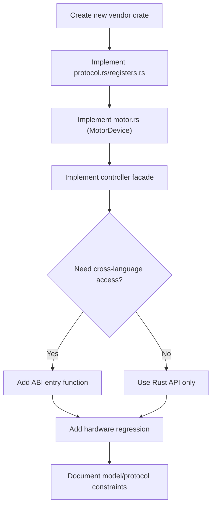

# Extending motorbridge

## Vendor Onboarding Flow

## Add a New Vendor (example: RobStride)

Goal: keep `motor_core` unchanged; add a new vendor crate.

1. Create crate (for example `motor_vendor_robstride`).
2. Implement vendor layers:
   - `protocol.rs`
   - `registers.rs`
   - `motor.rs` (implement `motor_core::MotorDevice`)
   - `controller.rs` (facade over `CoreController`)
3. Expose vendor access from ABI if needed (for example `motor_controller_add_robstride_motor`).
4. Add crate to workspace members.

## Add Models Under Existing Vendor (Damiao)

1. Open `motor_vendors/damiao/src/motor.rs`.
2. Extend model catalog entries (`model`, `pmax`, `vmax`, `tmax`).
3. Keep model strings consistent with user input.

## Protocol Compatibility Rule

Do not assume same-vendor models are always protocol-identical.
Validate at least:

- frame structure and arbitration IDs
- register mapping and data type
- control mode mapping
- limit ranges and scaling
- status/error semantics

If any differs, split implementation by sub-protocol profile.

## Suggested Hardware Regression

1. `enable -> ensure_mode(MIT) -> zero command`
2. trajectory follow test (position/velocity/torque)
3. register read/write validation (`rid=10` and critical R/W registers)
4. clear-error and recovery path
5. 10-30 min stability run
