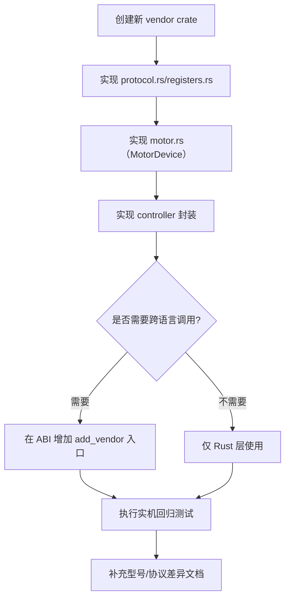

# 扩展开发指南

## 厂商接入流程图

## 新增品牌（例如 RobStride）

目标：不改 `motor_core`，只新增 vendor crate。

1. 新建 crate（例如 `motor_vendor_robstride`）。
2. 在 crate 内实现：
   - `protocol.rs`
   - `registers.rs`
   - `motor.rs`（实现 `motor_core::MotorDevice`）
   - `controller.rs`（封装 `CoreController`）
3. 如需跨语言调用，在 ABI 中增加接入函数（例如 `motor_controller_add_robstride_motor`）。
4. 在 workspace 里注册新 crate。

## 新增同品牌型号（Damiao）

1. 打开 `motor_vendors/damiao/src/motor.rs`。
2. 在型号目录中添加新条目（`model`、`pmax`、`vmax`、`tmax`）。
3. 保持型号字符串与调用侧输入一致。

## 协议兼容原则

不要假设同品牌不同型号协议必然一致，至少验证：

- 帧结构与 arbitration ID 规则
- 寄存器映射与数据类型
- 控制模式映射
- 范围参数与缩放关系
- 状态/故障语义

任何一项不一致，都建议在 vendor 内按子协议拆分实现。

## 建议最小回归清单

1. `enable -> ensure_mode(MIT) -> 零指令`
2. 轨迹跟随（位置/速度/力矩）
3. 寄存器读写验证（含 `rid=10` 及关键寄存器）
4. 清错与恢复流程
5. 10-30 分钟稳定性测试
