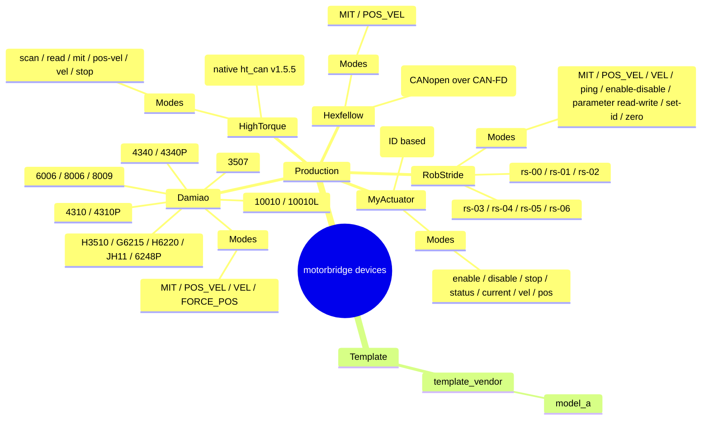

# Supported Devices

> **Channel compatibility details:** See [shared/channel-compat.md](../shared/channel-compat.md)

## Support Landscape

## Production Support

| Brand | Models | Control Modes | Register R/W | ABI Coverage | Notes |
|---|---|---|---|---|---|
| Damiao | 3507, 4310, 4310P, 4340, 4340P, 6006, 8006, 8009, 10010L, 10010, H3510, G6215, H6220, JH11, 6248P | scan, enable, disable, MIT, POS_VEL, VEL, FORCE_POS, set-id, set-zero | Yes (f32/u32) | Yes | Production baseline; use `--store 1 --verify-id 1` for ID updates |
| RobStride | rs-00, rs-01, rs-02, rs-03, rs-04, rs-05, rs-06 | scan, ping, enable, disable, MIT, POS_VEL, VEL, parameter read/write, set-id, zero | Yes (i8/u8/u16/u32/f32) | Yes | Uses 29-bit extended CAN IDs; default host/feedback ID `0xFD`; set-id aligned to upper-tool frame layout |
| MyActuator | X-series (runtime model string, default `X8`) | enable, disable, stop, status, current, vel, pos, version, mode-query | No (CLI command-level support) | Yes | Uses standard 11-bit IDs `0x140+id` / `0x240+id`; practical ID range 1..32 |
| HighTorque | hightorque (runtime model string; native `ht_can v1.5.5`) | scan, read, MIT, POS_VEL, VEL, stop, brake, rezero | No (vendor command-level support) | Yes | Unified `rad/rad/s/Nm` interface; native payload scaling handled internally |
| Hexfellow | CAN-FD (CANopen over CAN-FD) | MIT, POS_VEL | No (ABI-level support) | Yes | Requires `--transport socketcanfd`; VEL / FORCE_POS reported as unsupported |

## Template (Not Production)

| Brand | Models | Control Modes | Register R/W | ABI Coverage | Notes |
|---|---|---|---|---|---|
| template_vendor | model_a (placeholder) | Placeholder only | Placeholder only | No | Scaffolding for new vendor integration |

## Mode Legend

- MIT: position + velocity + stiffness + damping + torque feedforward
- POS_VEL: position + velocity limit
- VEL: velocity control
- FORCE_POS: position + velocity limit + torque ratio
