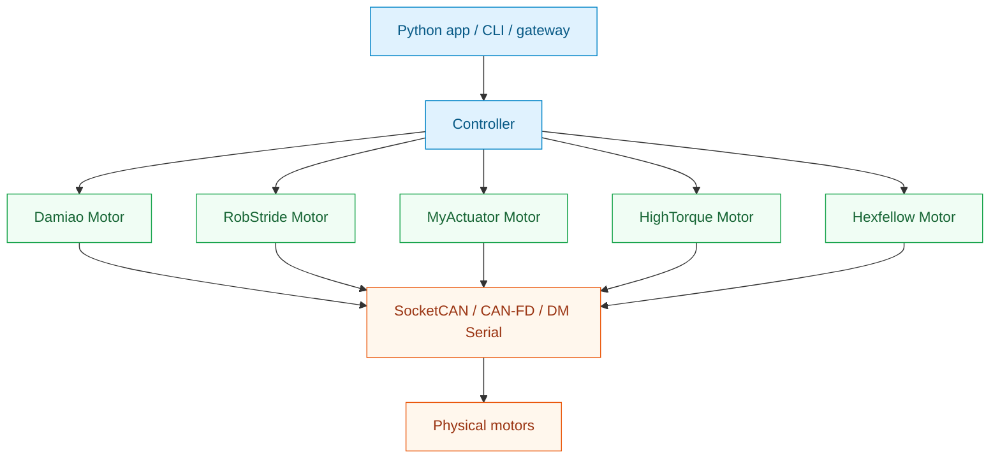

# MotorBridge Python SDK

<Badge variant="primary">v0.2.9</Badge> <Badge variant="secondary">Python 3.10+</Badge>

A unified, high-performance motor control library for Python. Control brushless motors from multiple vendors with a single, consistent API.

<Cards>
  <Card title="Quick Start" icon="rocket" href="quickstart">
    Get your first motor running in 5 minutes
  </Card>
  <Card title="Installation" icon="download" href="install">
    Install and configure your environment
  </Card>
  <Card title="API Reference" icon="book" href="api/controller">
    Complete API documentation
  </Card>
  <Card title="Examples" icon="code" href="tutorials/06-practical-recipes">
    Copy-paste ready code recipes
  </Card>
  <Card title="RobStride Parameters" icon="table" href="reference/robstride-parameter-tables">
    RobStride protocol notes and section 4 runtime parameter table
  </Card>
</Cards>

## Why MotorBridge?

<Cards>
  <Card title="Multi-Vendor" icon="gears">
    Support for Damiao, RobStride, MyActuator, HighTorque, and Hexfellow motors
  </Card>
  <Card title="Unified API" icon="layer-group">
    Same Python interface across all motor brands
  </Card>
  <Card title="High Performance" icon="bolt">
    Rust-based ABI for reliable, low-latency communication
  </Card>
  <Card title="Type Safe" icon="shield-check">
    Full type hints with dataclasses and enums
  </Card>
  <Card title="CLI Tools" icon="terminal">
    Built-in utilities for scanning, testing, debugging
  </Card>
  <Card title="Easy Integration" icon="plug">
    Context managers for automatic resource cleanup
  </Card>
</Cards>

## Quick Example

```python
from motorbridge import Controller, Mode

# Open CAN interface
with Controller("can0") as ctrl:
    # Add a Damiao motor
    motor = ctrl.add_damiao_motor(0x01, 0x11, "4340P")
    
    # Enable and configure
    ctrl.enable_all()
    motor.ensure_mode(Mode.MIT, 1000)
    
    # Send control command
    motor.send_mit(pos=0.5, vel=0.0, kp=30.0, kd=1.0, tau=0.0)
    
    # Read state
    state = motor.get_state()
    if state:
        print(f"Position: {state.pos:.3f} rad")
```

## Supported Vendors

| Vendor | Models | MIT | POS_VEL | VEL | FORCE_POS |
|--------|--------|-----|---------|-----|-----------|
| Damiao | 4310, 4340P, 6001 | ✅ | ✅ | ✅ | ✅ |
| RobStride | rs-00..rs-06 | ✅ | ✅ | ✅ | ❌ |
| MyActuator | X8 | ❌ | ✅ | ✅ | ❌ |
| HighTorque | HT | ✅ | ✅ | ✅ | ✅ |
| Hexfellow | * | ✅ | ✅ | ❌ | ❌ |

<Note>
Hexfellow motors require CAN-FD transport. Use `Controller.from_socketcanfd("can0")`.
</Note>

## Architecture



<Tip>
For the full project-level architecture, see [Source Architecture](source/project/architecture) and the [Source Documentation Atlas](source/index).
</Tip>

## Core Concepts

| Component | Description |
|-----------|-------------|
| **Controller** | Manages transport layer and multiple motor handles |
| **Motor** | Per-device handle for sending commands and reading state |
| **Mode** | Control mode enum (MIT, POS_VEL, VEL, FORCE_POS) |
| **MotorState** | Immutable dataclass containing motor feedback |

## Documentation Sections

<AccordionGroup>
  <Accordion title="Getting Started">
    - [Installation](install) - Set up your environment
    - [Transports](transports) - Configure CAN/Serial connections
    - [Quick Start](quickstart) - Your first motor control program
  </Accordion>
  
  <Accordion title="Tutorials">
    Step-by-step guides for common tasks:
    - [Scan & Identify](tutorials/01-scan-and-identify) - Find motors on CAN bus
    - [Enable & Status](tutorials/02-enable-and-status) - Read motor state
    - [Mode & Control](tutorials/03-mode-switch-and-control) - Send commands
    - [Multi-Motor](tutorials/04-multi-motor) - Control multiple motors
    - [Registers](tutorials/05-register-and-params) - Configure motor parameters
  </Accordion>
  
  <Accordion title="API Reference">
    - [Controller API](api/controller) - Main entry point
    - [Motor API](api/motor) - Per-motor operations
    - [Mode & State](api/mode-and-state) - Enums and data structures
    - [CLI Tools](api/cli) - Command-line utilities
  </Accordion>

  <Accordion title="Reference">
    - [Vendor Capability Matrix](reference/vendor-capability-matrix) - Supported vendors, modes, and parameter APIs
    - [CAN ID & Model Cheatsheet](reference/can-id-and-model-cheatsheet) - ID rules and model strings by vendor
    - [RobStride Parameter Tables](reference/robstride-parameter-tables) - Communication protocol summary and section 4 runtime parameter table
  </Accordion>

  <Accordion title="Source Documentation">
    - [Source Documentation Atlas](source/index) - Full repository documentation map
    - [Repository Overview](source/repository/overview) - Current production baseline and architecture links
    - [RobStride CLI/API Reference](source/rust-cli/robstride-api) - Complete RobStride command and protocol guide
    - [Python RobStride Binding](source/python/robostride-binding) - Core CLI, Python CLI, and Python SDK comparison
    - [WebSocket Gateway](source/integrations/ws-gateway/overview) - Gateway JSON operations and model requirements
  </Accordion>
</AccordionGroup>

## Installation

<Steps>
  <Step title="Install Package">
    ```bash
    pip install motorbridge
    ```
  </Step>
  
  <Step title="Configure CAN Interface">
    ```bash
    sudo ip link set can0 type can bitrate 1000000
    sudo ip link set can0 up
    ```
  </Step>
  
  <Step title="Run Your First Program">
    ```python
    from motorbridge import Controller
    
    with Controller("can0") as ctrl:
        motor = ctrl.add_damiao_motor(0x01, 0x11, "4340P")
        ctrl.enable_all()
        print("Motor ready!")
    ```
  </Step>
</Steps>

## Getting Help

<Callout type="info">
  - 📖 Read the [Tutorials](tutorials/01-scan-and-identify) for step-by-step guides
  - 🔍 Check [Troubleshooting](best-practices/troubleshooting) for common issues
  - 💻 Use `motorbridge-cli --help` for CLI reference
</Callout>

## License

MIT License - see the project repository for details.
