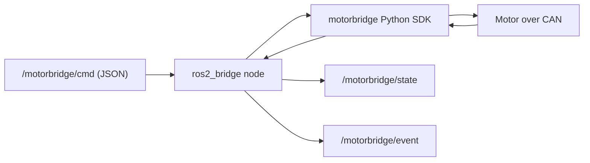

# ros2_bridge

> **Channel compatibility note**: See [snippets/channel-compat.md](../snippets/channel-compat.md) for the canonical reference on channel/transport configuration across all platforms.

ROS2 bridge for `motorbridge` using Python (`rclpy`) + existing `motorbridge` Python SDK bindings.



## Features

- Subscribe command topic and execute motor commands
- Publish motor state periodically
- Expose operational commands via same command topic:
  - `scan`
  - `set_id`
  - `verify`

## Topics

- Subscribed: `/motorbridge/cmd` (`std_msgs/String`, JSON payload)
- Published:
  - `/motorbridge/state` (`std_msgs/String`, JSON payload)
  - `/motorbridge/event` (`std_msgs/String`, JSON payload)

## Command JSON

Control:

```json
{"op":"enable"}
{"op":"disable"}
{"op":"mit","pos":0.0,"vel":0.0,"kp":20.0,"kd":1.0,"tau":0.0,"continuous":true}
{"op":"pos_vel","pos":3.10,"vlim":1.50,"continuous":true}
{"op":"vel","vel":0.5,"continuous":true}
{"op":"force_pos","pos":0.8,"vlim":2.0,"ratio":0.3,"continuous":true}
```

Calibration:

```json
{"op":"scan","start_id":1,"end_id":16,"feedback_base":16,"timeout_ms":100}
{"op":"set_id","old_motor_id":2,"old_feedback_id":18,"new_motor_id":5,"new_feedback_id":21,"store":true,"verify":true}
{"op":"verify","motor_id":5,"feedback_id":21,"timeout_ms":1000}
```

## Run

Prerequisites:

- ROS2 installed (`rclpy`, `std_msgs`)
- `motorbridge` Python package importable

From repo root:

```bash
PYTHONPATH=bindings/python/src:$PYTHONPATH \
python3 integrations/ros2_bridge/python/motorbridge_ros2_bridge.py \
  --channel can0 --model 4340P --motor-id 0x01 --feedback-id 0x11 --dt-ms 20
```

## Publish command examples

```bash
ros2 topic pub --once /motorbridge/cmd std_msgs/msg/String '{data: "{\"op\":\"enable\"}"}'
ros2 topic pub --once /motorbridge/cmd std_msgs/msg/String '{data: "{\"op\":\"vel\",\"vel\":0.5,\"continuous\":true}"}'
ros2 topic pub --once /motorbridge/cmd std_msgs/msg/String '{data: "{\"op\":\"scan\",\"start_id\":1,\"end_id\":16}"}'
```

## Notes

- `continuous=true` means command is resent at each timer tick (`--dt-ms`).
- `enable/disable/scan/set_id/verify` are one-shot operations.
