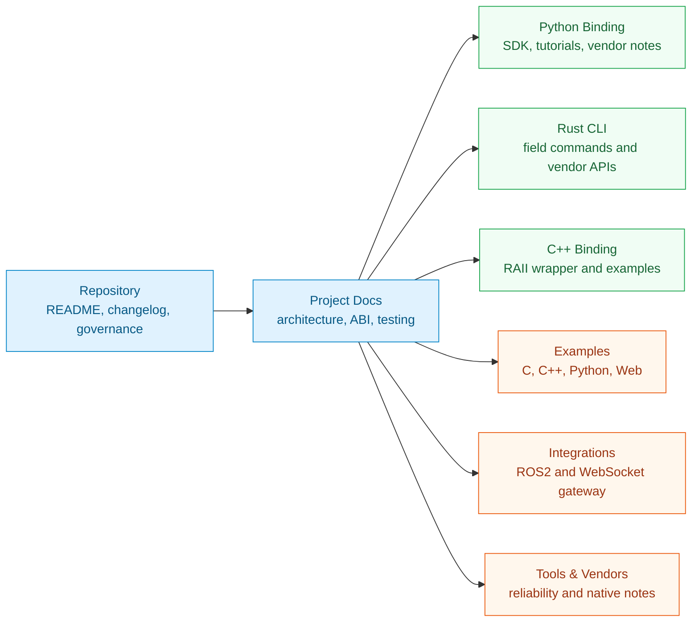
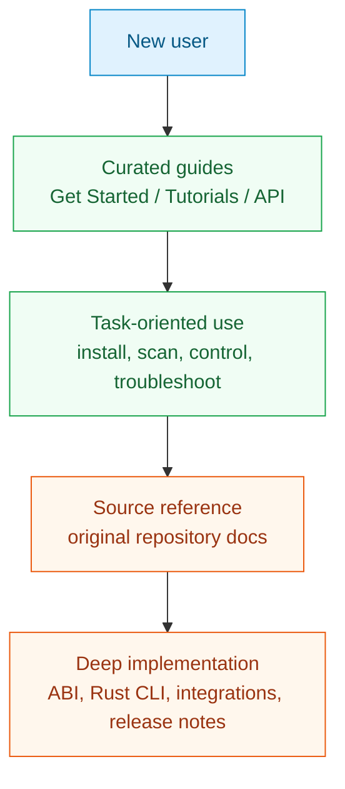

# Source Documentation Atlas

<Badge variant="primary">87 source pages</Badge> <Badge variant="secondary">MotorBridge v0.4.0</Badge>

This atlas organizes the full Markdown knowledge base imported from the `motorbridge` repository. Use the curated guides for learning paths, and use this source library when you need the original project-level details.

## Choose a Path

<Cards>
  <Card title="Repository" icon="git-branch" href="/source/repository/overview">
    Root README, changelog, release notes, contribution, security, and governance material.
  </Card>
  <Card title="Project Architecture" icon="diagram-project" href="/source/project/architecture">
    Core architecture, ABI design, device support, testing, distribution, and platform notes.
  </Card>
  <Card title="Python Binding" icon="python" href="/source/python/overview">
    Python package README, Damiao and RobStride binding notes, examples, and getting-started courses.
  </Card>
  <Card title="Rust CLI" icon="terminal" href="/source/rust-cli/overview">
    Native `motor_cli` usage and vendor-specific CLI references for Damiao, RobStride, and MyActuator.
  </Card>
  <Card title="C++ Binding" icon="braces" href="/source/cpp/overview">
    C++ wrapper usage and example project notes.
  </Card>
  <Card title="Examples" icon="code" href="/source/examples/overview">
    C, C++, Python, web HMI, and complete Damiao command examples.
  </Card>
  <Card title="Integrations" icon="plug" href="/source/integrations/overview">
    ROS2 bridge and WebSocket gateway documentation.
  </Card>
  <Card title="Tools & Vendors" icon="wrench" href="/source/tools/reliability/overview">
    Reliability tooling and vendor-native implementation notes.
  </Card>
</Cards>

## How to Read This Section

<Note>
Every imported page starts with a `Source:` note that points back to the original Markdown path in the `motorbridge` repository.
</Note>

- Use **Get Started**, **Tutorials**, and **API Reference** for polished task-oriented docs.
- Use **Source Documentation** when you need exact project README content, release qualification notes, or lower-level implementation references.
- Prefer the curated API pages for current Python binding behavior, then cross-check source pages for operational context.
