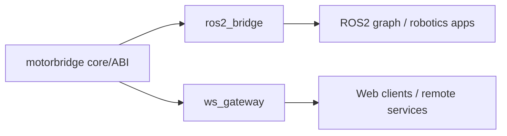

<Note>Source: `integrations/README.md`</Note>

# Integrations

<!-- channel-compat-note -->
## Channel Compatibility (PCAN + slcan + Damiao Serial Bridge)

- Linux SocketCAN uses interface names directly: `can0`, `can1`, `slcan0`.
- For USB-serial CAN adapters, bring up `slcan0` first: `sudo slcand -o -c -s8 /dev/ttyUSB0 slcan0 && sudo ip link set slcan0 up`.
- Damiao-only serial bridge transport is also available in CLI (`--transport dm-serial --serial-port /dev/ttyACM0 --serial-baud 921600`).
- Full Damiao serial-bridge interface list and command patterns are documented in `motor_cli/README.md` (section `3.6` in `motor_cli/README.zh-CN.md`).
- On Linux SocketCAN, do not append bitrate in `--channel` (for example `can0@1000000` is invalid).
- On Windows (PCAN backend), `can0/can1` map to `PCAN_USBBUS1/2`; optional `@bitrate` suffix is supported.

Production-oriented bridge adapters live here.

- `ros2_bridge/`: ROS2 integration (implemented)
- `ws_gateway/`: Rust WebSocket gateway (implemented, V1 JSON over WS)

## Experimental Windows Support (PCAN-USB)

Linux remains the primary target. Windows support is experimental and currently uses PEAK PCAN.

- Install PEAK PCAN driver + PCAN-Basic runtime (`PCANBasic.dll`).
- Use `can0@1000000` for Windows channel+bitrate in CLI/gateway commands.
