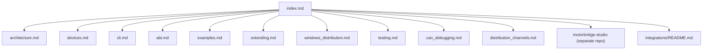

<Note>Source: `docs/en/index.md`</Note>

# motorbridge Docs (English)

This documentation set is aligned with the current `main` branch implementation.

## Documentation Navigation Graph

## Quick Links

- Architecture: [architecture.md](/source/project/architecture)
- CLI Guide: [cli.md](/source/project/cli)
- ABI Guide: [abi.md](/source/project/abi)
- Cross-language Examples: [examples.md](/source/project/examples)
- Supported Devices: [devices.md](/source/project/devices)
- Vendor Extension Guide: [extending.md](/source/project/extending)
- Windows Distribution: [windows_distribution.md](/source/project/windows-distribution)
- Testing Guide: [testing.md](/source/project/testing)
- CAN Debugging (Linux `slcan` + Windows `pcan`): [can_debugging.md](/source/project/can-debugging)
- Distribution Channels (APT/Homebrew/Winget/Scoop/Choco): [distribution_channels.md](/source/project/distribution-channels)
- MotorBridge Studio: separate repository `motorbridge-studio` (split from `tools/factory_calib_ui_ws`)
- Integrations: [`integrations/README.md`](/source/integrations/overview)
- WS Gateway: [`integrations/ws_gateway/README.md`](/source/integrations/ws-gateway/overview)

## What motorbridge Provides

- Vendor-agnostic core runtime (`motor_core`)
- Vendor protocol plugins (`motor_vendors/*`)
- Rust CLI (`motor_cli`)
- Stable C ABI (`motor_abi`) for C/C++/Python/others
- Python SDK package (`bindings/python`)
- C++ RAII wrapper package (`bindings/cpp`)

## Recommended Reading Order

1. [architecture.md](/source/project/architecture)
2. [devices.md](/source/project/devices)
3. [cli.md](/source/project/cli)
4. [abi.md](/source/project/abi)
5. [examples.md](/source/project/examples)
6. [extending.md](/source/project/extending)
7. [windows_distribution.md](/source/project/windows-distribution)
8. [can_debugging.md](/source/project/can-debugging)
9. [distribution_channels.md](/source/project/distribution-channels)
10. [testing.md](/source/project/testing)
