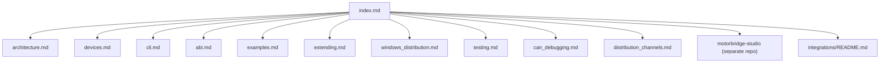

<Note>Source: `docs/en/index.md`</Note>

# motorbridge Docs (English)

This documentation set is aligned with the current `main` branch implementation.

## Documentation Navigation Graph

## Quick Links

- Architecture: [architecture.md](architecture.md)
- CLI Guide: [cli.md](cli.md)
- ABI Guide: [abi.md](abi.md)
- Cross-language Examples: [examples.md](examples.md)
- Supported Devices: [devices.md](devices.md)
- Vendor Extension Guide: [extending.md](extending.md)
- Windows Distribution: [windows_distribution.md](windows_distribution.md)
- Testing Guide: [testing.md](testing.md)
- CAN Debugging (Linux `slcan` + Windows `pcan`): [can_debugging.md](can_debugging.md)
- Distribution Channels (APT/Homebrew/Winget/Scoop/Choco): [distribution_channels.md](distribution_channels.md)
- MotorBridge Studio: separate repository `motorbridge-studio` (split from `tools/factory_calib_ui_ws`)
- Integrations: [`integrations/README.md`](../../integrations/README.md)
- WS Gateway: [`integrations/ws_gateway/README.md`](../../integrations/ws_gateway/README.md)

## What motorbridge Provides

- Vendor-agnostic core runtime (`motor_core`)
- Vendor protocol plugins (`motor_vendors/*`)
- Rust CLI (`motor_cli`)
- Stable C ABI (`motor_abi`) for C/C++/Python/others
- Python SDK package (`bindings/python`)
- C++ RAII wrapper package (`bindings/cpp`)

## Recommended Reading Order

1. [architecture.md](architecture.md)
2. [devices.md](devices.md)
3. [cli.md](cli.md)
4. [abi.md](abi.md)
5. [examples.md](examples.md)
6. [extending.md](extending.md)
7. [windows_distribution.md](windows_distribution.md)
8. [can_debugging.md](can_debugging.md)
9. [distribution_channels.md](distribution_channels.md)
10. [testing.md](testing.md)
