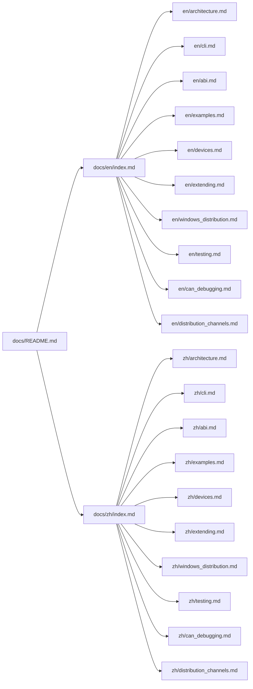

<Note>Source: `docs/README.md`</Note>

# Documentation Hub

- English: [en/index.md](en/index.md)
- 中文: [zh/index.md](zh/index.md)

The bilingual docs under `docs/en` and `docs/zh` are the maintained documentation structure.

## Docs Map

## Quick Entry

- EN unified scan: [`docs/en/cli.md`](en/cli.md)
- 中文统一扫描: [`docs/zh/cli.md`](zh/cli.md)
- EN Windows distribution: [`docs/en/windows_distribution.md`](en/windows_distribution.md)
- 中文 Windows 分发: [`docs/zh/windows_distribution.md`](zh/windows_distribution.md)
- EN CAN debugging (slcan + pcan): [`docs/en/can_debugging.md`](en/can_debugging.md)
- 中文 CAN 调试（slcan + pcan）: [`docs/zh/can_debugging.md`](zh/can_debugging.md)
- EN distribution channels: [`docs/en/distribution_channels.md`](en/distribution_channels.md)
- 中文分发渠道: [`docs/zh/distribution_channels.md`](zh/distribution_channels.md)
- EN testing guide: [`docs/en/testing.md`](en/testing.md)
- 中文测试指南: [`docs/zh/testing.md`](zh/testing.md)
