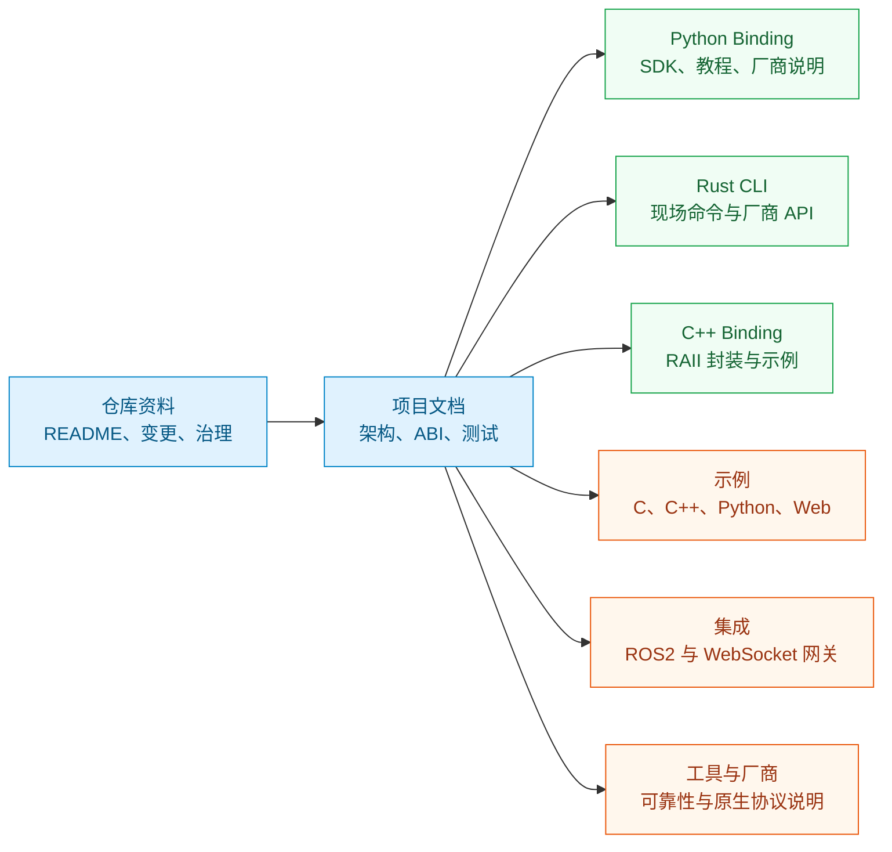
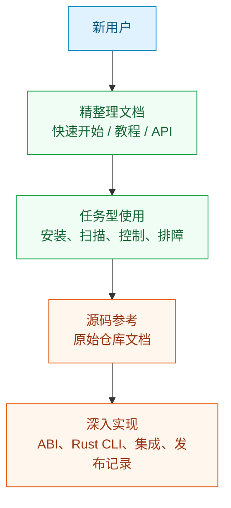

# 源码文档地图

<Badge variant="primary">87 篇源码文档</Badge> <Badge variant="secondary">MotorBridge v0.3.3</Badge>

这里整理了从 `motorbridge` 仓库导入的完整 Markdown 知识库。入门和 API 请优先看前面的精整理章节；需要原始项目细节、发布记录、底层 CLI/ABI/集成资料时，从这里进入。

## 选择阅读路径

<Cards>
  <Card title="仓库资料" icon="git-branch" href="/zh/source/repository/overview">
    根 README、变更日志、发布测试记录、贡献、安全和治理文档。
  </Card>
  <Card title="项目架构" icon="diagram-project" href="/zh/source/project/architecture">
    核心架构、ABI 设计、设备支持、测试、分发和平台说明。
  </Card>
  <Card title="Python Binding" icon="python" href="/zh/source/python/overview">
    Python 包 README、达妙/RobStride 绑定说明、示例和入门课程。
  </Card>
  <Card title="Rust CLI" icon="terminal" href="/zh/source/rust-cli/overview">
    原生 `motor_cli` 用法，以及达妙、RobStride、MyActuator 的 CLI 参考。
  </Card>
  <Card title="C++ Binding" icon="braces" href="/zh/source/cpp/overview">
    C++ 封装和示例工程说明。
  </Card>
  <Card title="示例" icon="code" href="/zh/source/examples/overview">
    C、C++、Python、Web HMI 和达妙完整命令示例。
  </Card>
  <Card title="集成" icon="plug" href="/zh/source/integrations/ros2-bridge/overview">
    ROS2 bridge 与 WebSocket gateway 文档。
  </Card>
  <Card title="工具与厂商" icon="wrench" href="/zh/source/tools/reliability/overview">
    可靠性工具和厂商原生实现说明。
  </Card>
</Cards>

## 阅读建议

<Note>
每篇导入页面开头都有 `Source:`，标明它在 `motorbridge` 仓库中的原始 Markdown 路径。
</Note>

- 新手阅读优先走 **快速开始**、**教程**、**接口手册**。
- 需要项目原始上下文、发布测试记录、底层 CLI/ABI/集成细节时，再进入 **源码文档**。
- Python binding 的当前行为以精整理 API 页面为准，源码文档作为工程背景和操作资料。
