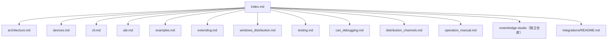

<Note>Source: `docs/zh/index.md`</Note>

# motorbridge 文档（中文）

本文档与当前 `main` 分支实现保持同步。

## 文档导航关系图

## 快速入口

- 架构说明：[architecture.md](/zh/source/project/architecture)
- CLI 使用：[cli.md](/zh/source/project/cli)
- ABI 接口：[abi.md](/zh/source/project/abi)
- 多语言示例：[examples.md](/zh/source/project/examples)
- 支持设备：[devices.md](/zh/source/project/devices)
- 扩展开发：[extending.md](/zh/source/project/extending)
- Windows 分发：[windows_distribution.md](/zh/source/project/windows-distribution)
- 测试指南：[testing.md](/zh/source/project/testing)
- CAN 调试（Linux `slcan` + Windows `pcan`）：[can_debugging.md](/zh/source/project/can-debugging)
- 分发渠道（APT/Homebrew/Winget/Scoop/Choco）：[distribution_channels.md](/zh/source/project/distribution-channels)
- 最终用户操作手册（PCAN 主链路 + Damiao 串口桥备用链路）：[operation_manual.md](/zh/source/project/operation-manual)
- MotorBridge Studio：独立仓库 `motorbridge-studio`（由 `tools/factory_calib_ui_ws` 拆分）
- 集成目录：[`integrations/README.md`](/source/integrations/overview)
- WS 网关：[`integrations/ws_gateway/README.zh-CN.md`](/zh/source/integrations/ws-gateway/overview)

## motorbridge 提供什么

- 与厂商无关的通用核心（`motor_core`）
- 厂商协议插件（`motor_vendors/*`）
- Rust CLI（`motor_cli`）
- 稳定 C ABI（`motor_abi`，供 C/C++/Python 等调用）
- Python SDK 包（`bindings/python`）
- C++ RAII 封装包（`bindings/cpp`）

## 建议阅读顺序

1. [architecture.md](/zh/source/project/architecture)
2. [devices.md](/zh/source/project/devices)
3. [cli.md](/zh/source/project/cli)
4. [abi.md](/zh/source/project/abi)
5. [examples.md](/zh/source/project/examples)
6. [extending.md](/zh/source/project/extending)
7. [windows_distribution.md](/zh/source/project/windows-distribution)
8. [can_debugging.md](/zh/source/project/can-debugging)
9. [distribution_channels.md](/zh/source/project/distribution-channels)
10. [operation_manual.md](/zh/source/project/operation-manual)
11. [testing.md](/zh/source/project/testing)
